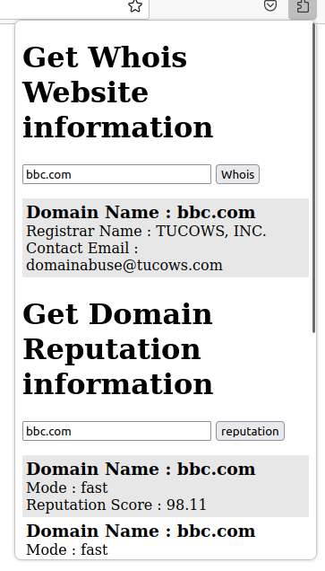
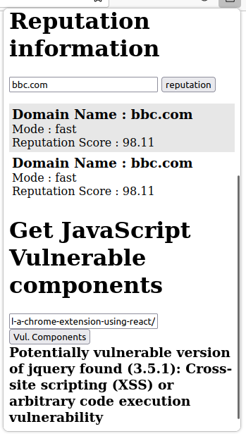

# browser-extension-project
This repository contains code for a browser extension that shows Whois information, domain reputation and vulnerable JavaScript components being used by a website.

# Browser Extension with Node.js Backend

This repository contains a browser extension that uses a Node.js backend. The backend is stored in the extension-backend directory. In order to run the extension on your machine, you will need to first download the project folder and run the backend and then load the extension in your browser.

# Prerequisites

Before you can run the extension, you will need to have the following software installed on your computer:

- Node.js
- A web browser that supports the extension's technology (e.g. Chrome, Firefox)

## To get started, follow these steps

- Clone this repository to your local machine.
- Navigate to the extension-backend directory in your terminal.
- Run `npm install` to install the necessary dependencies.
- Run `npm run server` to start the backend server.
- Once the backend server is running, load the extension in your browser:

### Load extension on Google Chrome

- Navigate to chrome://extensions/ in your browser.
- Enable "Developer mode" in the top right corner.
- Click "Load unpacked" and select the extension directory in this repository.

### Load extension on Firefox

- Navigate to about:debugging#/runtime/this-firefox in your browser.
- Click "Load Temporary Add-on" and select the manifest.json file in the extension directory of this repository.
